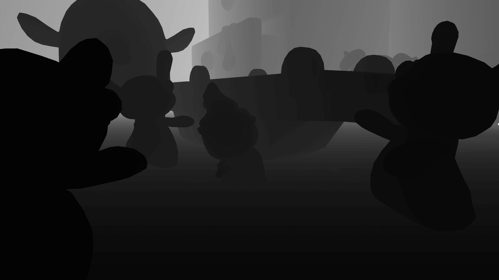

# Facebook 3D Photos from Unity

This tool takes screenshots from Unity along with the depth texture, you can use these images to create 3D photos on Facebook to showcase your game.

"3D photos" is just a fancy name for the parallax effect on Facebook, it's not real 3D.

## How to use

- Copy the `Facebook3DPhotos.cs` and `DepthDumpShader.shader` files to your project
- Make sure you have a camera with the `MainCamera` tag
- Run the `3D Photos/Take Screenshot` menu item
- Open the project folder and locate the `screenshot.png` and `screenshot_depth.png` files
- Upload the two files to Facebook, make sure the depth file contains the `_depth` suffix, otherwise it won't work
- *Voilá!* Facebook will generate a 3D photo automatically

## License

MIT
